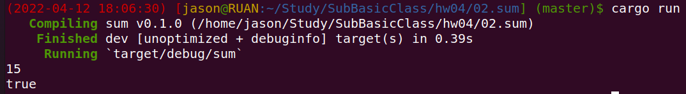

## 1 为枚举交通信号灯实现一个 trait，trait里包含一个返回时间的方法，不同的灯持续的时间不同

### 代码

```rust
enum TrafficLight {
    GREEN,
    YELLOW,
    RED,
}

trait DurationTime {
    fn duration_time(&self) -> u32;
}

impl DurationTime for TrafficLight {
    fn duration_time(&self) -> u32 {
        match self {
            TrafficLight::GREEN => 10,
            TrafficLight::YELLOW => 20,
            TrafficLight::RED => 30,
        }
    }
}

fn main() {
    println!("{}", TrafficLight::GREEN.duration_time());
    println!("{}", TrafficLight::YELLOW.duration_time());
    println!("{}", TrafficLight::RED.duration_time());
}

```

### 执行效果


## 2 实现一个函数，为u32类型的整数集合求和，参数类型为 &[u32]，返回类型为Option，溢出时返回None

### 代码

```rust
fn sum(nums: &[u32]) -> Option<u32> {
    let mut total: u64 = 0;
    for num in nums.iter() {
        total = total + *num as u64;
        if total > std::u32::MAX as u64 {
            return None;
        }
    }
    return Some(total as u32);
}

fn main() {
    let a = [1, 2, 3, 4, 5];
    let total = sum(&a);
    println!("{}", total.unwrap()); // 15

    let a = [1, std::u32::MAX];
    let total = sum(&a);
    println!("{}", total.is_none()) // true
}

```

### 执行效果



## 3 实现一个打印图形面积的函数，它接收一个可以计算面积的类型作为参数，比如圆形，三角形，正方形，需要用到泛型和泛型约束

### 代码

```rust
use std::ops::Div;
use std::ops::Mul;

trait Area<T> {
    fn area(&self) -> T;
}

#[derive(Debug)]
struct Square<T> {
    width: T,
}

impl<T: Copy + Mul<Output = T>> Area<T> for Square<T> {
    fn area(&self) -> T {
        self.width * self.width
    }
}

#[derive(Debug)]
struct Rectangle<T, U> {
    width: T,
    height: U,
}

impl<T, U> Area<T> for Rectangle<T, U>
where
    T: Mul<U, Output = T> + Copy,
    U: Mul<T, Output = T> + Copy,
{
    fn area(&self) -> T {
        self.width * self.height
    }
}

#[derive(Debug)]
struct Triangle<T> {
    base: T,
    height: T,
}

impl<T: Copy + Mul<Output = T> + Div<f64, Output = T>> Area<T> for Triangle<T> {
    fn area(&self) -> T {
        (self.base * self.height) / 2.0
    }
}

#[derive(Debug)]
struct Circle<T> {
    radius: T,
}

impl<T: Copy + Mul<Output = T> + Mul<f64, Output = T>> Area<T> for Circle<T> {
    fn area(&self) -> T {
        self.radius * self.radius * 3.14
    }
}

fn get_area<T>(graph: &impl Area<T>) -> T {
    return graph.area();
}

fn main() {
    let a = Square { width: 5 };
    let area = get_area(&a);
    println!("{}", area); // 25

    let a = Rectangle {
        width: 3.0,
        height: 4.0,
    };
    let area = get_area(&a);
    println!("{}", area); // 12

    let a = Triangle {
        base: 3.0,
        height: 4.0,
    };
    let area = get_area(&a);
    println!("{}", area); // 6

    let a = Circle { radius: 5.0 };
    let area = get_area(&a);
    println!("{}", area); // 78.5
}

```

### 执行效果

