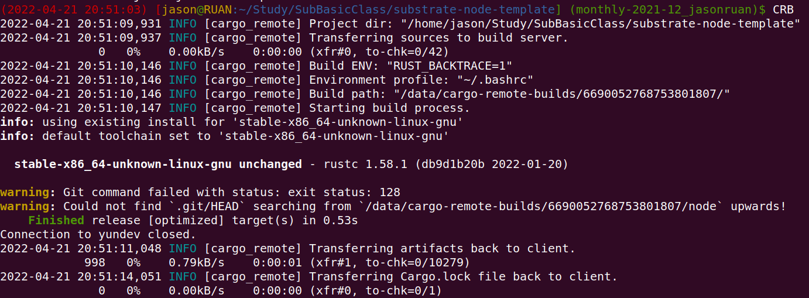
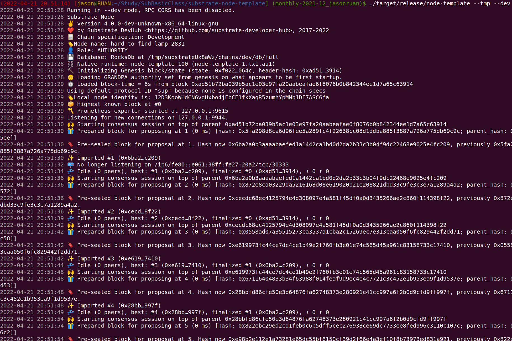

# hw05

## 实现存证模块的功能，包括：创建存证；撤销存证。

使用substrate-node-template v3.0.0版本，提交的Github链接必须包含：⚠️代码运行的截图图片+⚠️全部代码

### 代码

https://github.com/xiaobanclub/substrate-node-template/blob/monthly-2021-12_jasonruan/pallets/poe/src/lib.rs#L54

### 运行

## 为存证模块添加新的功能，转移存证，接收两个参数，一个是内容的哈希值，另一个是存证的接收账户地址。

使用substrate-node-template v3.0.0版本，提交的Github链接必须包含：⚠️代码运行的截图图片+⚠️全部代码

### 代码

https://github.com/xiaobanclub/substrate-node-template/blob/monthly-2021-12_jasonruan/pallets/poe/src/lib.rs#L95

### 运行截图

